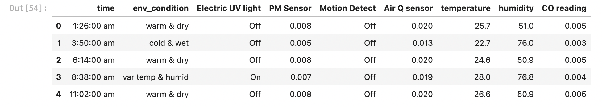

# environmental_classification

The used dataset comes from [IOT_SENSOR.csv](./IOT_SENSOR.csv)

    

The goal is to classify environmental condition, given information from IOT sensors. The environmental condition are classified by "warm & dry", "cold & wet", "var temp & humid".

The exploratory data analysis and data preprocessing are explained by detail inside the code. Please refer [here](./environmental_classification/tree/main/environmental_classification.ipynb).
