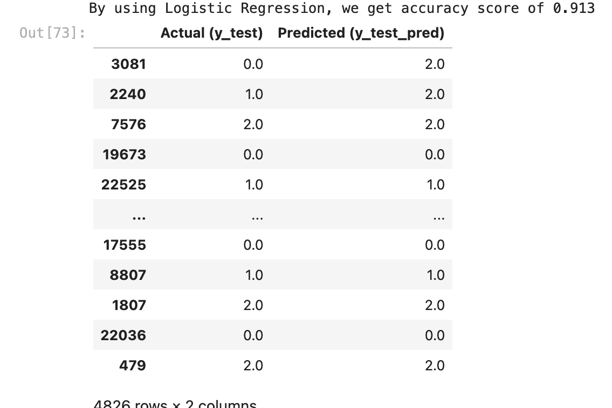

# environmental_classification

The used dataset comes from [IOT_SENSOR.csv](./IOT_SENSOR.csv)

    

The goal is to classify environmental condition, given information from IOT sensors. The environmental condition are classified by "warm & dry", "cold & wet", "var temp & humid".

The exploratory data analysis, data preprocessing, and model building are explained by detail inside the code. Please refer [here](./environmental_classification.ipynb).

## Model Testing

In this project, KNN and Logistic Regression are employed to classify environmental condition. With the training score is shown on table below

<table><thead>
  <tr>
    <th></th>
    <th>K-Nearest Neighbor</th>
    <th>Logistic Regression</th>
  </tr></thead>
<tbody>
  <tr>
    <td>Score</td>
    <td>0.921411</td>
    <td><b>0.921722</b></td>
  </tr>
</tbody>
</table>

With dataset tesing, we gain a score of <b>0.913</b> by using Logistic Regression.

    

Referring to confution matrix below, we can see that the environments recorded by IOT sensor are classified correctly. However the model can be improved by using better model, e.g XGBoost, Neural Network, etc.

    

